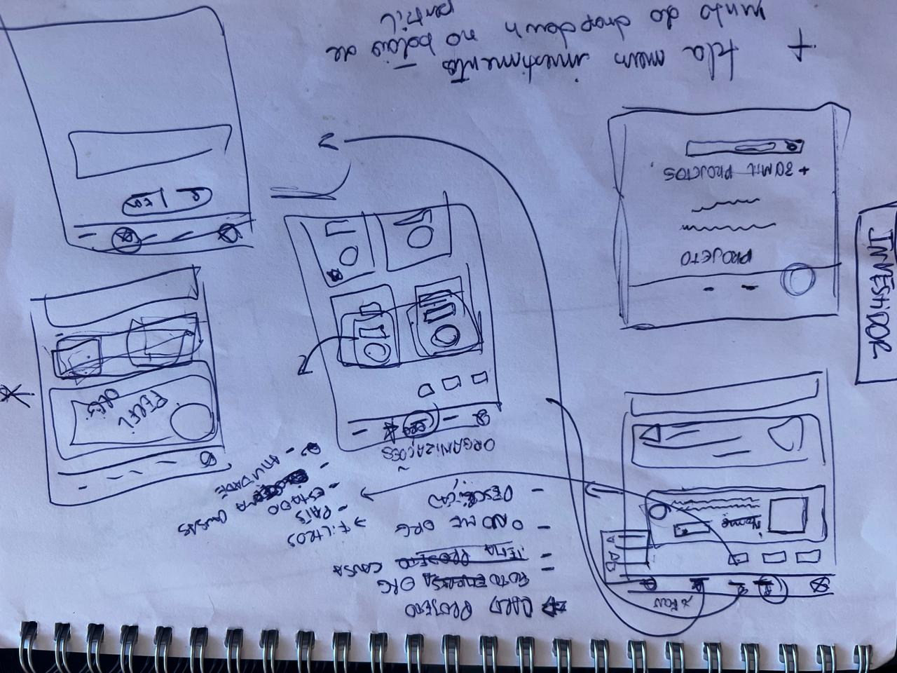
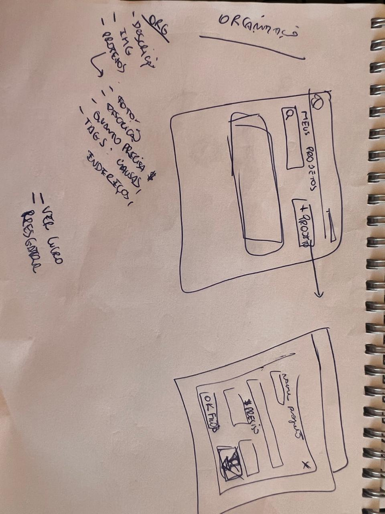
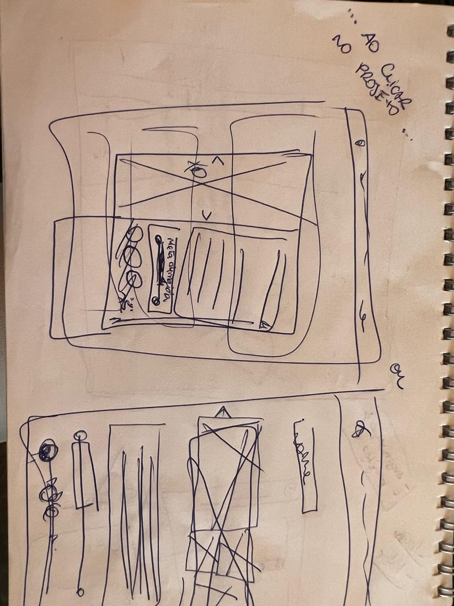
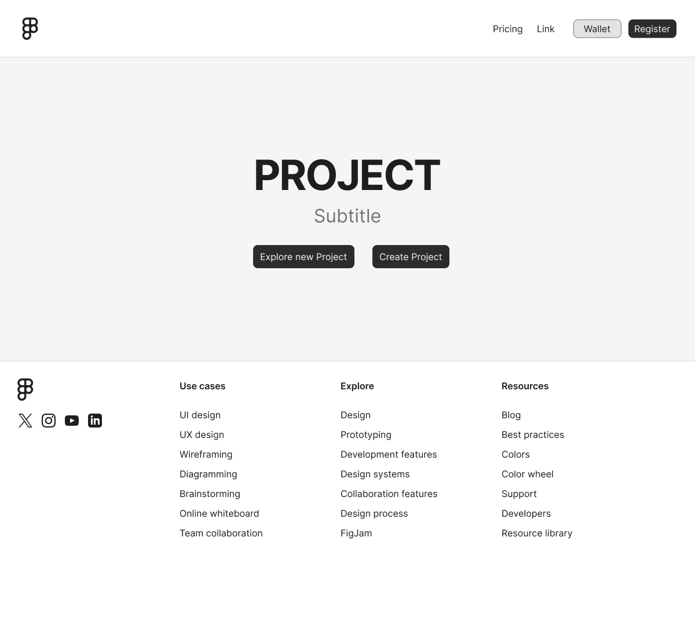
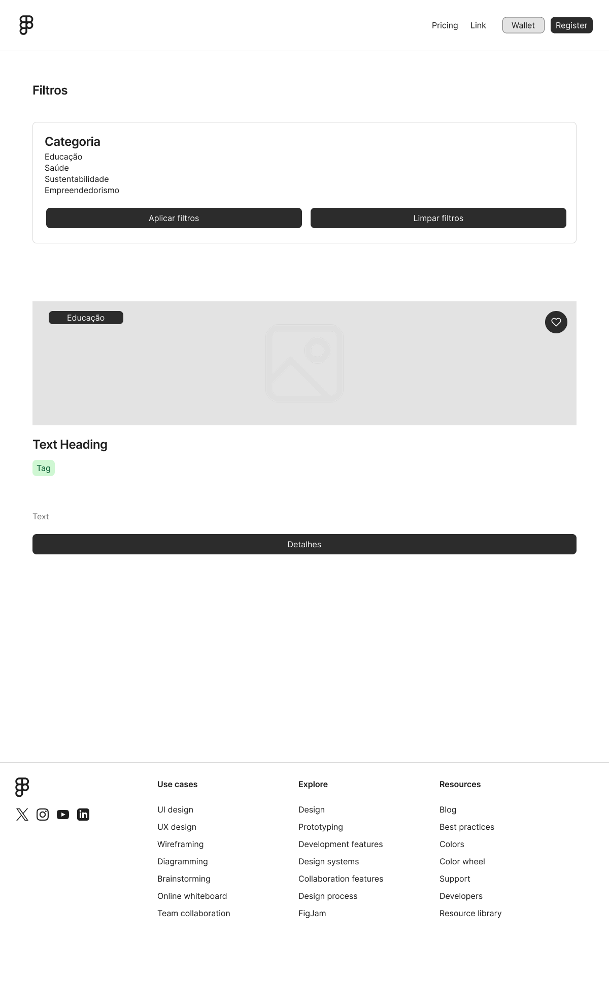
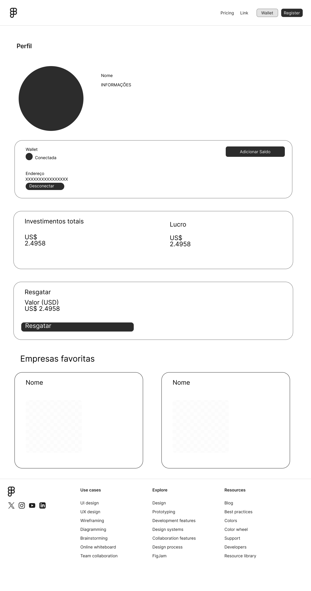
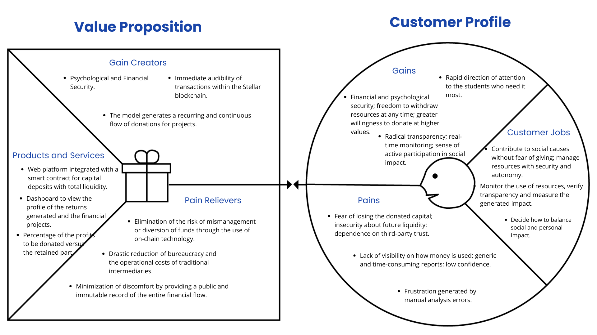

# 4Bridges

## **1. Introdução**

### 1.1. Contexto do Projeto

O 4Bridge é uma plataforma descentralizada de doação social, que visa revolucionar o ecossistema de filantropia digital por meio da blockchain Stellar. O projeto aborda a crescente demanda por mecanismos de doação que sejam transparentes, sustentáveis e que mitiguem o risco financeiro para os apoiadores.

### 1.2. Problema

O modelo filantrópico global atravessa uma crise de confiança sistêmica, marcada pela falta de transparência na gestão de recursos. Pesquisas internacionais mostram que a confiança é o fator mais determinante na decisão de doar, mas também a maior barreira: um estudo da Charities Aid Foundation (2023) aponta que mais de 50% dos não doadores citam dúvidas sobre a aplicação dos recursos como motivo de hesitação. De forma semelhante, pesquisas da BBB Wise Giving Alliance (2025) revelam que quase 70% dos potenciais doadores expressam preocupação com o uso indevido de seus dados e doações quando apoiam instituições desconhecidas.

Essa desconfiança amplifica o maior obstáculo do modelo: a perda de capital. A doação tradicional é uma transação de via única e irreversível, um sacrifício financeiro que ativa o viés cognitivo da aversão à perda (KAHNEMAN, 2012). Para o doador, isso significa um dilema entre segurança patrimonial e impacto social, o que limita tanto o volume quanto a frequência das contribuições.

O resultado é um modelo insustentável, frequentemente descrito como um “balde furado” (SARGEANT, 2009), no qual a captação não acompanha a evasão. Dados do Fundraising Effectiveness Project (2023) indicam que as taxas globais de retenção de novos doadores raramente ultrapassam 25% ao ano, confirmando o caráter esporádico e pouco previsível das doações. Essa espiral de desconfiança, sacrifício financeiro e baixa retenção mina o planejamento estratégico das organizações e mantém um enorme potencial de capital filantrópico inexplorado.

### 1.3. Objetivos

- Proporcionar uma plataforma intuitiva onde usuários possam apoiar causas sociais sem abrir mão do seu capital principal.
    
- Garantir a distribuição automatizada e auditável dos rendimentos gerados para os projetos, conforme regras programáveis.
    
- Oferecer aos projetos sociais um canal inovador para captação de recursos, com fluxo de caixa mais previsível e fortalecimento da confiança com seus apoiadores.
    
- Validar a viabilidade técnica e de produto do modelo "yield donation" no ecossistema Stellar/Soroban.    
    

### 1.4. Justificativa

O projeto surgiu da necessidade de alinhar o potencial da tecnologia blockchain com o impacto social, eliminando o risco da perda de capital e viabilizando a filantropia, permitindo que mais pessoas contribuam com projetos de impacto social. Além disso, o uso da tecnologia Stellar garante a rastreabilidade dos rendimento doados, reconstruindo a confiança e criando um ecossistema de apoio mais forte e engajado.

---

## **2. Visão geral da aplicação**

### 2.1. Proposta de Valor
Para melhor entender o projeto e a proposta de valor envolvida à aplicação, foi desenvolvido o seguinte canvas proposta de valor:

Figura 1 - Rascunhos do protótipo de baixa fidelidade.

  

 Fonte: (Material produzido pelos autores, 2025).

Figura 2 - Rascunhos do protótipo de baixa fidelidade.

  

 Fonte: (Material produzido pelos autores, 2025).

Figura 3 - Rascunhos do protótipo de baixa fidelidade.

  

 Fonte: (Material produzido pelos autores, 2025).

Já para o a digitalização das telas no figma foram feitas os seguintes wireframes no figma: 
 
Figura 4 - Wireframe da aplicação.

  

 Fonte: (Material produzido pelos autores, 2025).

 
Figura 5 - Wireframe da aplicação.

  

 Fonte: (Material produzido pelos autores, 2025).

 
Figura 6 - Wireframe da aplicação.

  

 Fonte: (Material produzido pelos autores, 2025).

Para ver melhor cada wireframe acesse o link do figma: https://www.figma.com/design/61pQLLpxmorW98mTKshkIJ/hackMeridian?node-id=0-1&t=AM1NvXknhQ0CXrG8-1.

#### 2.1.1. Produtos & Serviços

- Plataforma web integrada a um smart contract para depósitos de capital com liquidez total; 
- Painel de visualização do perfil com os rendimentos gerados e os projetos financiados; 
- Mecanismo de split de rendimento que permite que o usuário configure o percentual dos juros a ser doado versus o retido para si;
- Emissão de NFTs simbólicos como certificados digitais de impacto, gamificando a experiência de doação.

#### 2.1.2. Gain Creators

- **Segurança Psicológica e Financeira:** Apoiadores contribuem sem medo de perder seu patrimônio principal.
- **Transparência:** Auditabilidade imediata de transações dentro da blockchain Stellar.
- **Engajamento Contínuo:** O modelo gera um fluxo de doações recorrente e contínuo para os projetos.
- **Flexibilidade e Controle:** O usuário define o nível de apoio através da configuração do split.

#### 2.1.3. Pain Relievers

- Eliminação do risco de má gestão ou desvio de fundos através do uso da tecnologia on-chain;
- Redução drástica da burocracia e dos custos operacionais de intermediários tradicionais;
- Minimização da desconfiança ao fornecer um registro público e imutável de todo o fluxo financeiro.

#### 2.1.4. Público alvo

##### 1 - Doadores Individuais Modernos (crypto-native e impact-driven): 
- Jovens e adultos que já usam cripto, stablecoins ou fintechs.
- Pessoas interessadas em impacto social, mas que não querem perder liquidez.

- Perfil: investidores de varejo, early adopters de blockchain, comunidade Web3.

##### 2 - Filantropos e Investidores de Impacto (High-net-worth individuals e ESG):

- Pessoas ou fundos que já apoiam causas sociais, mas que buscam modelos mais transparentes e eficientes.

- Podem enxergar sua plataforma como uma forma de “maximizar impacto sem comprometer patrimônio”.

- Perfil: family offices, investidores ESG, doadores recorrentes.

##### 2 - Organizações Sociais (ONGs, fundações e projetos de impacto):

- Entidades que enfrentam a imprevisibilidade das doações e precisam de fluxo de caixa mais estável.

- Se beneficiam diretamente do modelo de yield sustentável e da transparência via blockchain.

- Perfil: ONGs pequenas e médias, fundações educacionais, ambientais ou de saúde.

### 2.2. Detalhamento da Solução

#### 2.2.1. Funcionalidades Principais

- Conexão segura com a plataforma via carteira Freighter.

- Depósito de capital no vault de doação com configuração do split de rendimento.

- Visualização do capital depositado, rendimentos acumulados e total doado.
    
- Distribuição automatizada dos rendimentos para os projetos sociais via smart contract.
    
- Resgate do capital principal a qualquer momento, sem taxas ou penalidades.
    
- Visualização do certificado de impacto (NFT) recebido por cada ciclo de doação.
    
- Histórico completo e auditável de todas as transações na blockchain.

#### 2.2.2. Diferenciais Competitivos

- **Liquidez Total:** O único modelo de doação que permite ao apoiador reter 100% de seu capital.
    
- **Transparência Garantida:** Todas as operações são públicas e imutáveis na Stellar.
    
- **Sustentabilidade:** Gera um fluxo contínuo de recursos para as causas, em vez de doações pontuais.
    
- **Governança Comunitária:** Roadmap futuro prevê que os próprios apoiadores decidam quais projetos serão listados.

---

## 3. Aplicação do projeto

### 3.1. Fluxo do usuário

**Telas Principais e Fluxos**

- **Tela de Boas-Vindas e Conexão de Carteira:** Primeiro ponto de contato, simples e direto.
   
- **Dashboard Principal:** Visão geral do capital do usuário, impacto total gerado e lista de projetos apoiados.
    
- **Página de Exploração de Projetos:** Listagem detalhada das causas disponíveis para apoio.
    
- **Modal de Depósito:** Fluxo intuitivo para definir o valor e o split de rendimento.
    
- **Tela de Resgate (Withdraw):** Interface para solicitar o resgate do capital principal.
    
- **Galeria de Certificados (NFTs):** Área para visualizar os NFTs recebidos como prova de impacto.
    
- **Tela de Histórico de Transações:** Log detalhado de todas as operações, com links para o explorador de blocos da Stellar.
    

&nbsp; &nbsp; &nbsp; &nbsp; O processo de design incluiu protótipos de baixa fidelidade para validação rápida de fluxos e usabilidade, culminando no protótipo de baixa fidelidade que guiou o desenvolvimento. Para melhor visualização do fluxo, pode-se obserar a imagem abaixo referente ao rascunho do protótipo das telas e posterior digitalização em wireframes no figma.

Figura 7 - Canvas proposta de valor da 4Bridges.

  

 Fonte: (Material produzido pelos autores, 2025).

---

## 4. Versão final da aplicação 

### 4.1. Funcionalidades Implementadas

- Conexão com carteira da rede Stellar (Freighter).
    
- Depósito de capital no smart contract Soroban via interface web.
    
- Resgate (withdraw) do capital principal depositado.
    
- Lógica on-chain para o registro de depósitos e saques.
    
- Visualização do saldo depositado pelo usuário.

### 4.2. Telas e Fluxos Principais Desenvolvidos

- **Conexão de Carteira:** Fluxo funcional de autenticação na plataforma.
    
- **Página de Projetos (Mock):** Interface para visualização de um projeto de exemplo.
    
- **Depósito:** Modal e lógica para interagir com a função `deposit` do contrato.
    
- **Resgate:** Botão e lógica para interagir com a função `withdraw` do contrato.
    
- **Dashboard Simples:** Exibição do saldo atual do usuário no vault.    

### 4.3. Tecnologias Utilizadas

- **Soroban SDK:** Desenvolvimento e deploy do smart contract na Testnet.
- **React :** Construção do frontend interativo.
- **TypeScript/JavaScript:** Lógica de negócio e integração com a blockchain no lado do cliente.
- **Stellar Wallets:** Integração com a carteira Freighter para assinatura de transações.

### 4.4. What AI tools and LLMs have you used?
&nbsp; &nbsp; &nbsp; &nbsp; Para receber insights, levantar questionamentos, melhorar ideias e buscar ajuda com alguns erros, foi usada as seguintes ferramentas tecnologicas:
- Stella AI;
- ChatGPT;
- Gemini PRO;
- V0;
- Perplexity;
- Claude.

## **5. Estudo de mercado e plano de marketing**

### 5.1. Resumo Executivo
&nbsp; &nbsp; &nbsp; &nbsp; O Impact Vault se posiciona como uma solução pioneira no setor de "Philanthropy-Fi", oferecendo um modelo de doação de capital protegido que atrai um novo perfil de doadores e garante sustentabilidade para projetos sociais. O foco na plataforma Stellar permite alcance global com custos operacionais mínimos.

### 5.2. Análise de Mercado
&nbsp; &nbsp; &nbsp; &nbsp; O mercado de doações está em um ponto de inflexão. De um lado, o modelo tradicional (Web2) enfrenta uma crise de confiança devido à falta de transparência e taxas elevadas. Do outro, a filantropia cripto (Web3) ainda busca um modelo sustentável.

&nbsp; &nbsp; &nbsp; &nbsp; Nossa plataforma se posiciona exatamente nesta intersecção, oferecendo um modelo de "Doação de Rendimento" (Lossless Donation), onde o impacto social é gerado de forma contínua sem que o doador perca seu capital. A escolha da rede Stellar nos confere uma vantagem competitiva crucial em velocidade e custo, democratizando o acesso a este novo modelo.

&nbsp; &nbsp; &nbsp; &nbsp; Para posicionar o 4Bridge e forma clara no cenário filantrópico, é essencial analisar as soluções existentes e identificar as lacunas que nosso projeto preenche. O benchmarking a seguir compara nosso modelo inovador com as principais abordagens do mercado, sendo elas: 

- The Giving Block: Plataforma líder em doações de criptomoedas para ONGs, com foco em facilidade e integração.

- Giveth: Plataforma Web3 de doações com governança e recompensas via token.

- Engiven: Solução focada em doações em cripto e ações combinadas para organizações religiosas e ONGs.

- Coinbase Commerce: Infraestrutura robusta para aceitar criptomoedas em sites, com grande user base.

| Funcionalidade / Benefício          | Impact Vault | The Giving Block | Giveth | Engiven | Coinbase Commerce |
| ----------------------------------- | ------------ | ---------------- | ------ | ------- | ----------------- |
| Liquidez total do capital principal | ✅            | ❌                | ❌      | ❌       | ❌                 |
| Impacto via rendimento              | ✅            | ❌                | ✅      | ❌       | ❌                 |
| Transparência on-chain              | ✅            | ✅                | ✅      | ❌       | ❌                 |
| Split programável de rendimentos    | ✅            | ❌                | ❌      | ❌       | ❌                 |
| Suporte multi-moeda                 | ✅            | ✅                | ✅      | ✅       | ✅                 |
| Integração com DeFi real            | ✅            | ❌                | ✅      | ❌       | ❌                 |

### 5.3. Plano de Marketing 

&nbsp; &nbsp; &nbsp; &nbsp; A estratégia de marketing do Impact Vault foi cuidadosamente elaborada para amplificar sua visibilidade, engajando diretamente o público-alvo e fortalecendo seu posicionamento no ecossistema de doações digitais e Web3. Com foco em ações digitais, a comunicação utilizará redes sociais, parcerias estratégicas com organizações sociais, instituições públicas e canais especializados, sempre privilegiando uma linguagem clara, acessível e um design visual acolhed
or.
#### 5.3.1. Product

&nbsp; &nbsp; &nbsp; &nbsp; 4Bridge é uma plataforma descentralizada de doações que combina segurança, transparência e flexibilidade, utilizando blockchain Stellar e contratos inteligentes Soroban. Diferencia-se por permitir ao usuário manter liquidez total do capital principal, com rendimento destinado a projetos sociais escolhidos, certificados NFT de impacto, dashboard em tempo real e governança participativa. O produto oferece uma experiência inovadora, escalável e confiável para engajar doadores digitais, organizações sociais e investidores sociais.

---

#### 5.3.2. Price
&nbsp; &nbsp; &nbsp; &nbsp; O modelo de precificação será baseado em taxas transparentes e competitivas, aplicadas sobre os rendimentos gerados no vault, garantindo sustentabilidade financeira para manutenção e evolução da plataforma. Haverá níveis diferenciados – versões gratuitas com funcionalidades básicas para usuários comuns e planos premium para ONGs e empresas, incluindo recursos extras, dashboards avançados e relatórios detalhados. Política de incentivos e isenções específicas pode ser aplicada para ampliar acessibilidade inicial.

#### 5.3.3. Place

&nbsp; &nbsp; &nbsp; &nbsp; A distribuição e acesso ao 4Bridge será digital, com foco inicial em comunidades e projetos sociais conectados à blockchain Stellar, abrangendo Brasil e demais mercados emergentes. A plataforma terá presença online forte, incluindo website institucional, integração com wallets populares, marketplaces Web3 e parcerias estratégicas com instituições filantrópicas, aceleradoras e organizações ESG para ampliação do alcance. O onboarding será facilitado por tutoriais, webinars e networking digital.

#### 5.3.4. Promotion

&nbsp; &nbsp; &nbsp; &nbsp; A estratégia promocional contempla:

- Campanhas digitais focadas em públicos de impacto social, entusiastas de cripto e investidores institucionais.
    
- Conteúdo educativo sobre doações programáveis e benefícios do modelo de liquidez, via blogs, podcasts e lives.
    
- Participação em eventos blockchain e hackathons para visibilidade técnica e network.
    
- Parcerias com ONGs e influenciadores sociais para demonstração e validação.
    
- Programas de referral e gamificação para recompensar indicações e engajamento contínuo.
    
- Relações públicas focadas na mídia especializada em filantropia e tecnologia.

---
## **6. Plano de execução**

### Roadmap Financeiro Pós-MVP

- Modelo de receita: cobrança de **x% sobre os rendimentos da pool**.  
- O capital principal dos usuários permanece intocado, garantindo impacto social e liquidez total.  
- Gamificação via **NFTs** para engajamento e reconhecimento do impacto social.

### 6.1. Validação do MVP
**Objetivo:** Mostrar que o MVP funciona na prática e gera interesse.

| Item | Descrição | Custo Estimado (USD) | Receita Potencial (USD) | Lucro Estimado (USD) |
|------|-----------|--------------------|------------------------|---------------------|
| Teste com usuários reais | Incentivos para projetos sociais e doadores | 1.000 – 2.000 | - | - |
| Coleta de métricas de uso | Ferramentas de análise e monitoramento | 500 – 1.000 | - | - |
| Feedback qualitativo | Entrevistas e suporte inicial | 500 – 1.000 | - | - |
| **Subtotal Fase 1** | - | **2.000 – 4.000** | - | - |

**Entregáveis:** Relatório de validação + métricas iniciais de impacto.

---

### 6.2. Refinamento e Aprimoramento do Produto
**Objetivo:** Melhorar UX/UI, performance do MVP e engajamento com gamificação.

| Item | Descrição | Custo Estimado (USD) | Receita Potencial (USD) | Lucro Estimado (USD) |
|------|-----------|--------------------|------------------------|---------------------|
| Aprimoramento UX/UI | Ajustes de design, dashboards e painéis | 1.500 – 3.000 | - | - |
| Otimização smart contracts e backend | Garantir segurança, eficiência e escalabilidade | 2.000 – 4.000 | - | - |
| Gamificação via NFTs | Criar NFTs de impacto que simbolizam contribuições, reforçando engajamento | 1.000 – 2.000 | Pode gerar receita via minting ou marketplace | Variável |
| **Subtotal Fase 2** | - | **4.500 – 9.000** | - | - |

**Entregáveis:** MVP aprimorado, pronto para mais usuários e engajamento com gamificação.

---

### 6.3. Marketing e Monetização via Pool
**Objetivo:** Atrair usuários, aumentar volume da pool, gerar receita e engajamento.

| Item | Descrição | Custo Estimado (USD) | Receita Potencial (USD) | Lucro Estimado (USD) |
|------|-----------|--------------------|------------------------|---------------------|
| Campanhas direcionadas | Marketing digital e publicidade | 2.000 – 4.000 | 3% – 5% dos rendimentos da pool | Depende do volume da pool |
| Parcerias estratégicas | ONGs, fundações e comunidades DeFi | 500 – 1.500 | Aumenta volume de usuários e rendimentos | Depende do volume da pool |
| Conteúdo educativo | Vídeos, guias e materiais online | 500 – 1.000 | Incentiva engajamento e novos aportes | Depende do volume da pool |
| Incentivos via NFTs | Promoções e recompensas digitais que incentivam aportes recorrentes | 500 – 1.000 | Receita adicional via minting ou marketplace | Variável |
| **Subtotal Fase 3** | - | **3.500 – 7.500** | 5.000 – 25.000 (ano 1) | 5.000 – 25.000 |

**Entregáveis:** Crescimento de usuários, volume da pool, receita gerada e engajamento via NFTs.

---

## Resumo Financeiro Total

| Tipo de Custo | Valor Estimado (USD) |
|---------------|--------------------|
| Fase 1 – Validação | 2.000 – 4.000 |
| Fase 2 – Refinamento + NFTs | 4.500 – 9.000 |
| Fase 3 – Marketing e Monetização | 3.500 – 7.500 |
| **Total Estimado** | **10.000 – 20.500** |

| Receita Potencial (x% sobre rendimentos da pool) | Lucro Estimado |
|--------------------------------------------------------|----------------|
| 5.000 – 25.000 (ano 1) | 5.000 – 25.000 |

**Pontos principais:**  
 - Receita depende do volume de rendimentos da pool e adoção das NFTs.  
- Lucro líquido é próximo à receita, considerando custos operacionais já cobertos nas fases anteriores.  
 - Gamificação via NFTs aumenta engajamento, fidelização e potencial de receita extra.

## 7. Por que o uso da Blockchain Stellar

&nbsp; &nbsp; &nbsp; &nbsp;A escolha da blockchain Stellar é uma escolha estratégica para o sucesso e diferencial da plataforma.  Stellar oferece uma combinação única de velocidade, segurança, baixo custo e escalabilidade, características essenciais para operacionalizar uma solução descentralizada de doações que visa atender tanto usuários individuais quanto organizações sociais e investidores institucionais em escala global.

### 7.1. Velocidade e Custo Reduzido
- Transações rápidas via Stellar Consensus Protocol (SCP) com taxas mínimas (~0.00001 XLM por transação). 
&nbsp; &nbsp; &nbsp; &nbsp; Transações rápidas e tarifas baixíssimas permitem que mesmo pequenos aportes sejam economicamente viáveis, democratizando o acesso ao sistema e possibilitando micropagamentos frequentes. Isso é crucial para a sustentabilidade do vault e para estimular o engajamento recorrente dos apoiadores.

### 7.2. Contratos Inteligentes Soroban
- Contratos inteligentes em Rust/WASM usando Soroban SDK. 
&nbsp; &nbsp; &nbsp; &nbsp; A robustez e segurança dos contratos inteligentes Soroban permitem a implementação da lógica complexa de liquidez do capital principal, divisão programável dos rendimentos e emissão de certificados NFT - que é uma ideia futura do projeto. Além disso, facilitam a auditabilidade em tempo real das operações, aumentando a transparência e a confiança de todos os stakeholders.

### 7.3. Escalabilidade e Inclusão Global
- Infraestrutura distribuída, compatível com múltiplos ativos e moedas via Stellar Assets e Liquidity Pools. 
&nbsp; &nbsp; &nbsp; &nbsp; A infraestrutura de Stellar é desenhada para suportar elevado volume de transações com muita eficiência, o que garante que o Impact Vault possa crescer sem gargalos técnicos. A capacidade de suportar múltiplas moedas permite que a plataforma atenda a um público global diversificado, promovendo inclusão financeira em mercados emergentes e consolidando o impacto social em diferentes regiões.

### 7.4. Segurança e Transparência
- Ledger imutável + Horizon API + indexers (StellarExpert, Dune) para monitoramento on-chain. 
&nbsp; &nbsp; &nbsp; &nbsp; Stellar oferece um ambiente seguro, resiliente e comprovado, onde todas as operações são imutáveis e rastreáveis, reforçando o compromisso do Impact Vault com a transparência radical. Essa característica é vital para combater a desconfiança histórica em doações, assegurando responsabilidade e governança claras.

### 7.5. Ecossistema e Parcerias
- Anchors e SEPs (SEP-10, SEP-24, SEP-12, SEP-31) + integração com wallets (Freighter, Albedo) + oráculos (Band, DIA). 
&nbsp; &nbsp; &nbsp; &nbsp; Por ser uma rede com crescente ecossistema dedicado a soluções sociais e de finanças descentralizadas, Stellar propicia sinergias, integrações e oportunidades de parcerias que aceleram a inovação contínua do projeto, garantindo uma evolução alinhada com as tecnologias e demandas do mercado.

&nbsp; &nbsp; &nbsp; &nbsp; Em resumo, a blockchain Stellar não é apenas uma infraestrutura tecnológica, mas um pilar essencial que sustenta sua proposta de valor, viabilidade e impacto, configurando-se como um diferencial competitivo decisivo no panorama das doações digitais e do financiamento social inovador.

## **8. Conclusões**
&nbsp; &nbsp; &nbsp; &nbsp; O 4Bridge é uma plataforma descentralizada baseada na blockchain Stellar que reinventa o modelo tradicional de doações sociais. Permitindo que o usuário mantenha total liquidez sobre o capital aportado, a plataforma direciona apenas os rendimentos gerados aos projetos sociais escolhidos, assegurando um impacto contínuo, seguro e transparente.  Essa solução alia inovação tecnológica e sustentabilidade social, criando um ambiente escalável e confiável que atrai diversos perfis de apoiadores.